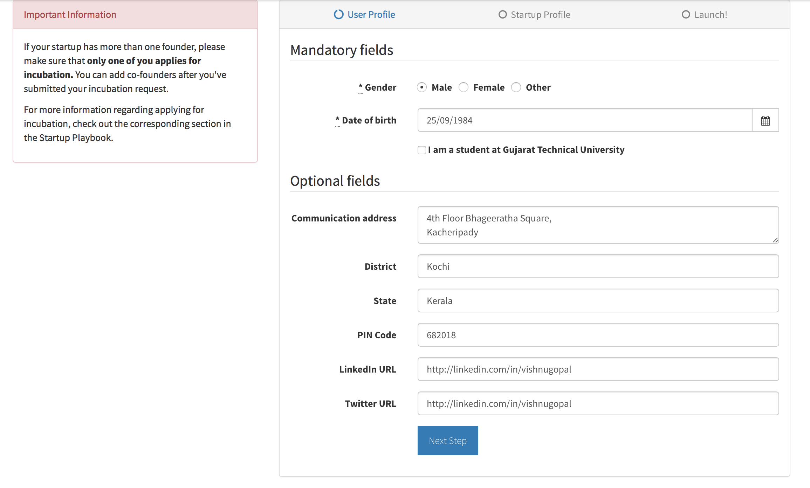
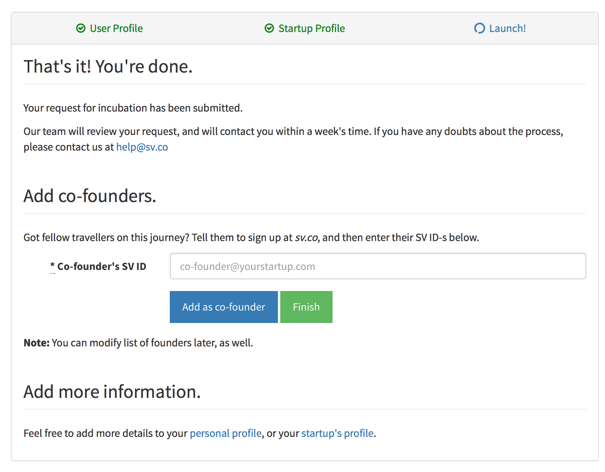



# The Startup Village Application

## Eligibility

Any founding team can apply to join Startup Village. We don't have specific criteria in terms of the business sectors we accept or the type of products (hardware or software) you build. But **we're structured to best help first time founders**. If you are a founder in college or right out of college, or you are thinking of starting up but don't know how to, you are welcome to join.[^1]

## Applying

The Startup Village application is entirely online. You start by going to the [application page](http://SV.CO/apply) and creating an SV.CO ID. 

---
An SV.CO ID is an account associated with your email address that is used for all things Startup Village.

**Note:** if you had an SV ID before August 5 2015, you'll have to create a [fresh new SV.CO ID](https://sv.co/). Old IDs created through the legacy Startup Village website will not work.

All founders of a startup need to have separate SV.CO IDs to apply. But when you submit your startup application, it's best if one founder starts and completes the application process.

*Note*: if you don't have an idea or a team yet, you are in the Idea Discovery stage, and you can't apply to Startup Village yet. But don't fret: read our notes on the [Idea Discovery stage](stages/1-idea-discovery.md) to proceed.

---
During the process, you submit your idea, add your team members, and submit your initial idea slides[^2]. Once your slides are evaluated and accepted, you are in!

In the first section, you fill in your basic information. It's best to fill in as much of the optional fields as you can.

If you are a student of GTU, **make sure you fill in your University Roll Number**:

---
Next you create your basic Startup Profile. The most important item here is your deck. To get pointers on how to create a good deck, see the [Idea Discovery](stages/1-idea-discovery.md) page.

---
And that's it! You can then add in co-founders here. *Note:* Currently, it's compulsory for you to have at least one cofounder for a successful application[^3].

## Application Evaluation
When you apply, we evaluate you based on your idea and business model as you've demonstrated in your product slides. The [Idea Discovery stage](stages/1-idea-discovery.md) has more resources on how to prepare great slides. 

If your application is rejected, a Startup Village representative will contact you with pointers, and ideas about how to re-apply. Unlike other startup accelerators or incubators, Startup Village does not have selection criteria based on the sector of your business or qualifications of your team. What we evaluate is the soundness of your proposal and how well you have thought out your product pitch.

*Pro tip*: If you send us a link to an early prototype of your idea, your chances of getting in go up dramatically. As you'll learn, our evaluation processes emphasize what *you can do* with your skills. 

## Acceptance
If you are accepted, the next step is to sign a [formal legal agreement with Startup Village](2-legal-agreement.md). 

---
[^1]: This doesn't mean we discriminate against experienced founders. On the contrary, you'll probably get accepted faster and move through stages quicker. If you think we can add value, we'll be happy to help!
[^2]: Use sites such as [SlideShare](http://www.slideshare.net), [SpeakerDeck](https://speakerdeck.com) or [Google Slides](http://www.google.com/slides/about/) to share your product deck.
[^3]: This is because we believe a team of at least three, and preferably four founders work best. Read up on [roles](5-startup-roles.md) to learn more about what it takes to build a startup team.