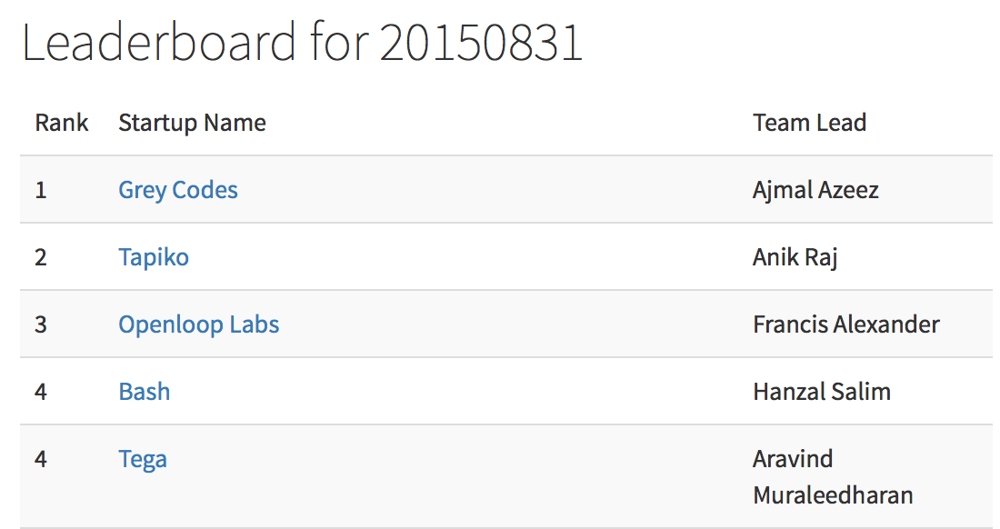



# Leaderboards

Note: this entire section is still WIP and subject to change.

Leaderboards are how SV.CO tracks progress for our startups. A leaderboard is generated from scratch every week, and it is visually represented as a simple table with Rank, Startup Timeline & Team Leader columns:

One important thing to note is that Leaderboards **never show** the best startups at SV.CO. Rather, they show startups that have **improved the most** compared to the previous leaderboard.

This is because Leaderboards are generated weekly, and startups start afresh every week.The reason that leaderboards work this way is that from our past experience, we've realized that startups need a forcing function to advance at a pace that's comfortable to them[^1].

## Karma Points

Karma points are how we score startups for placement in the Leaderboard. We use *Karma* in the literal (& not the spiritual) sense[^2]  of the Sanksrit word: Karma is work or action, and also the *intention behind that action*.

As an example: even if you completely mistunderstand a task & execute it terribly, we consider that good karma *because you made an attempt to learn*. If you then ask for feedback and manage to improve, that's great karma.

Here's some *examples* of activities that earn Karma points:

* Update the [Verified Timeline](3-verified-timelines.md).
* Post resources to [Public Slack](1.2-slack.md).
* Ask feedback on work done.
* Submit a good Deck.
* Ask questions[^3].
* Contribute to this Playbook.
* Help other Startups.
* Perform Bonus Activities.

Three additional points to note:

* SV.CO does not intend to provide an exhaustive list of activities that will earn Karma points. The intention here is to improve, not to top the leaderboard.
* Startups don't earn Karma points directly: Founders do. Karma points of a startup is just a simple total of its Founders' Karma points.
* The exact Karma points earned (either cumulatively by startups or individually by the Founders) will not be made public. They are just used to generate the leaderboard.

You can view the [latest leaderboard here](https://sv.co/about/leaderboards).

---
[^1]: We think startups need a guide (average measure) of how fast other folks move. For them to get off their backsides and do something. Additional ways we reinforce this is using the [Stages framework](5-startup-stages.md), and setting weekly targets and bonus activities.
[^2]: More at [Wikipedia](https://en.wikipedia.org/wiki/Karma)
[^3]: As long as you have a genuine doubt, it doesn't matter much if you think they are *stupid* questions, or if we think they are great questions.